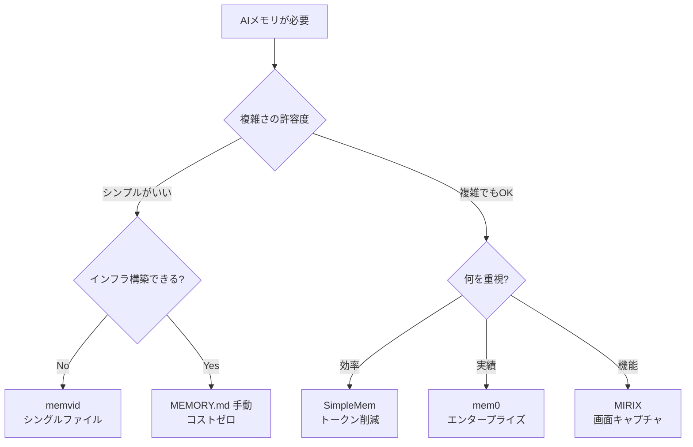

## はじめに

AIエージェントが「記憶」を持つことで、長期的な文脈を保持し、よりパーソナライズされた応答が可能になる。2026年1月時点で注目されているメモリ系プロジェクトを比較してみた。

## プロジェクト一覧

| ⭐️ | 名前 | 概要 |
|------|------|------|
| 46,000 | [mem0](https://github.com/mem0ai/mem0) | 最人気。User/Session/Agent メモリ、YC 出身 |
| 15,000 | [claude-mem](https://github.com/thedotmack/claude-mem) | Claude Code 用。セッション自動記録→AI圧縮→次回注入 |
| 12,600 | [memvid](https://github.com/memvid/memvid) | 🆕 Rust 製シングルファイルメモリ、DB不要 |
| 6,000 | [PAI](https://github.com/danielmiessler/PAI) | 人間中心の Agentic AI インフラ |
| 3,500 | [MIRIX](https://github.com/Mirix-AI/MIRIX) | 画面キャプチャからメモリ構築、6種のメモリ |
| 2,300 | [SimpleMem](https://github.com/aiming-lab/SimpleMem) | 🆕 効率特化、LOCOMO 最高精度 |

※ ⭐️は GitHub スター数（2026年1月時点、概数）

## LOCOMO ベンチマーク比較

[LOCOMO](https://arxiv.org/abs/2402.17753)（Long-term Conversational Memory）は、LLM の長期会話記憶を評価する標準ベンチマーク。平均300ターン・9Kトークン・最大35セッションの長期対話で評価。

| プロジェクト | F1 スコア | 処理時間 | 備考 |
|-------------|----------|---------|------|
| **SimpleMem** | **43.24%** | 480.9s | 効率と精度のバランス◎ |
| mem0 | 34.20% | 1934.3s | 実績豊富 |
| MIRIX | 85.4% | - | 評価条件が異なる可能性 |

※ GPT-4.1-mini での評価。モデル・設定により結果は変動。

## アーキテクチャ比較

| プロジェクト | アプローチ | インフラ | 特徴 |
|-------------|-----------|---------|------|
| mem0 | Vector DB + Graph | PostgreSQL, Neo4j 等 | 豊富なインテグレーション |
| SimpleMem | Semantic Compression | LanceDB | 30× トークン削減 |
| memvid | Smart Frames | **不要（シングルファイル）** | ポータブル |
| MIRIX | Multi-Agent | PostgreSQL | 画面キャプチャ、6種メモリ |
| claude-mem | Hook System | SQLite + Chroma | Claude Code 特化 |
| PAI | THE ALGORITHM | ファイルベース | 人間中心設計 |

## 各プロジェクトの詳細

### mem0
YCombinator 出身の最も人気のあるプロジェクト。User/Session/Agent の3レベルでメモリを管理。25種以上の Vector Store、15種以上の LLM に対応。Neo4j によるグラフメモリ（Mem0ᵍ）も提供。

**詳細**: [mem0: AIエージェントのためのメモリレイヤー](/yasuhito/articles/mem0-ai-memory-layer)

### SimpleMem 🆕
2026年1月公開の新星。「Semantic Lossless Compression」で効率を追求。LOCOMO ベンチで mem0 を上回る F1 スコア。MCP サーバーと Claude Skills に対応し、すぐに使える。

**詳細**: [SimpleMem: 効率重視のLLMエージェントメモリ](/yasuhito/articles/simplemem-efficient-memory)

### memvid 🆕
Rust 製のシングルファイル型メモリ。データベース不要で、`.mv2` ファイル1つで完結。動画エンコーディングにインスパイアされた「Smart Frames」設計。タイムトラベルデバッグが可能。

**詳細**: [memvid: シングルファイルで完結するAIメモリ](/yasuhito/articles/memvid-single-file-memory)

### MIRIX
画面キャプチャから自動的にコンテキストを抽出。Core/Episodic/Semantic/Procedural/Resource/Knowledge の6種類のメモリを持つ。各メモリに専用エージェントを割り当てるマルチエージェント構成。

**詳細**: [MIRIX: 6種のメモリを持つマルチエージェント記憶システム](/yasuhito/articles/mirix-multi-agent-memory)

### claude-mem
Claude Code 向けに特化。セッション終了時に自動で会話を記録し、AI が重要な情報を圧縮して次回セッション開始時に注入。ただし**トークン消費が激しい**という批判あり。

**詳細**: [claude-mem: Claude Code に永続メモリを追加する](/yasuhito/articles/claude-mem-persistent-memory)

### PAI
「人間の能力を拡張する」がコンセプト。THE ALGORITHM（7フェーズ実行）、ISC（理想状態基準）、TELOS（目標理解）など独自の概念を持つ。メモリだけでなく、エージェント全体のライフサイクル管理を担う。

**詳細**: [PAI: 人間中心のAIエージェント基盤を理解する](/yasuhito/articles/pai-personal-ai-infrastructure)

## 選び方ガイド

### 用途別おすすめ

| 用途 | おすすめ | 理由 |
|------|---------|------|
| **まず試す** | MEMORY.md 手動 | コストゼロ、完全コントロール |
| **効率重視** | SimpleMem | LOCOMO 最高 F1、MCP対応 |
| **本番/企業** | mem0 | 最も成熟、サポート充実 |
| **インフラ嫌い** | memvid | シングルファイル、DB不要 |
| **Claude Code** | MEMORY.md 手動 | claude-mem はトークン問題あり |
| **画面から学習** | MIRIX | ユニークなアプローチ |

## まとめ

メモリ系プロジェクトは急速に進化中。2026年1月時点での現実的な選択：

1. **まず手動**（MEMORY.md）で始める - ほとんどのケースでこれで十分
2. 物足りなくなったら **SimpleMem** - 効率良く、Claude と統合可
3. エンタープライズなら **mem0** - 実績、サポート、インテグレーション
4. インフラ不要なら **memvid** - シングルファイルの手軽さ

「自動メモリ」は便利そうに見えて、**トークンコストと複雑さのトレードオフ**がある。シンプルに始めて、必要に応じて足すのが賢明。
