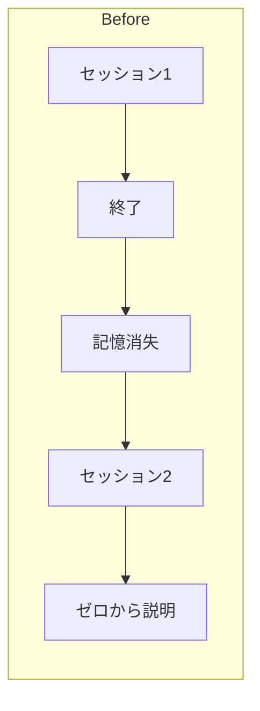
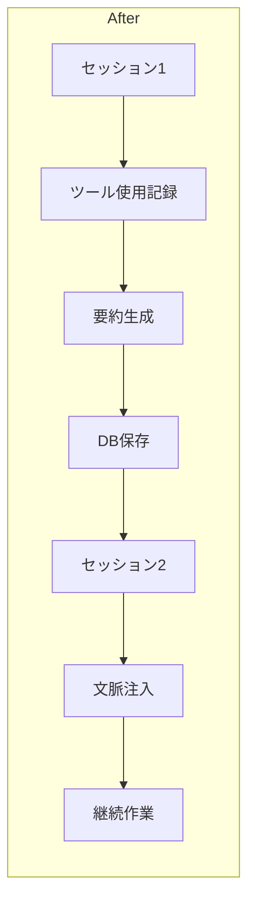
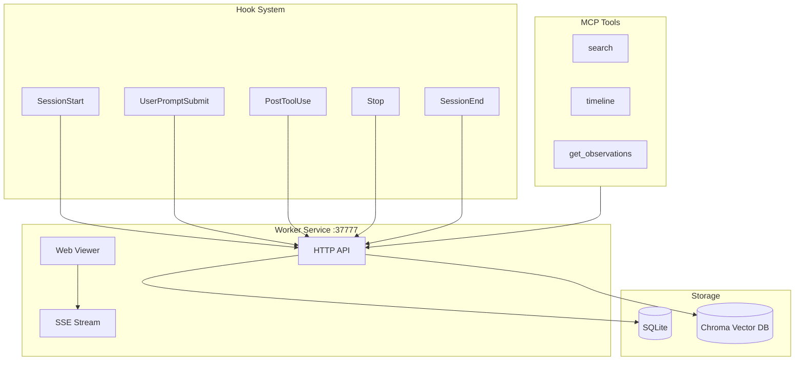
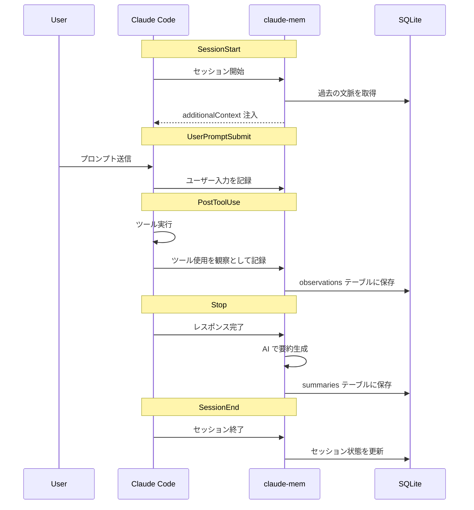
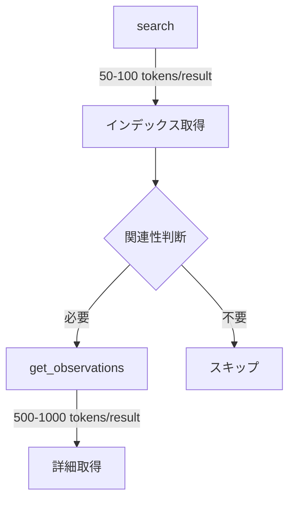

## claude-mem とは

**claude-mem** は Claude Code 用の永続メモリ圧縮システム。GitHub スター数は約15,000で、AI メモリ系プロジェクトの中でも注目度が高い。

コンセプトは「セッションを超えた文脈の保持」。ツール使用を自動記録 → AI で要約・圧縮 → 次回セッションに注入、というサイクルを回す。

https://github.com/thedotmack/claude-mem

## なぜ必要か

Claude Code の課題：

- **セッション揮発性** - セッション終了でコンテキスト消失
- **プロジェクト文脈の断絶** - 昨日やった作業を覚えていない
- **再説明コスト** - 毎回同じ説明を繰り返す





## アーキテクチャ



### コンポーネント

| コンポーネント | 役割 |
|--------------|------|
| **Hook System** | Claude Code のライフサイクルイベントをキャプチャ |
| **Worker Service** | HTTP API (port 37777)、Web UI、SSE ストリーム |
| **SQLite** | セッション、観察、要約を永続化 |
| **Chroma** | ベクトル検索（セマンティック + キーワード） |
| **MCP Tools** | Claude からメモリを検索するためのツール |

## 5つの Hook



### 各 Hook の役割

1. **SessionStart** - 過去の文脈を取得し、Claude に注入
2. **UserPromptSubmit** - ユーザーのプロンプトを記録
3. **PostToolUse** - ツール実行結果を「観察」として記録
4. **Stop** - Claude の応答を要約
5. **SessionEnd** - セッション状態を更新

## 観察 (Observation) の構造

ツール使用が「観察」として構造化される：

```typescript
interface Observation {
  type: string;           // 観察タイプ
  title: string;          // 何をしたか
  subtitle: string;       // 補足情報
  facts: string[];        // 重要な事実
  narrative: string;      // 物語形式の説明
  concepts: string[];     // 関連概念
  files_read: string[];   // 読んだファイル
  files_modified: string[]; // 変更したファイル
}
```

保存先：`~/.claude-mem/memory.db` の `observations` テーブル

## 文脈注入 (Context Injection)

SessionStart で過去の文脈が自動注入される：

```typescript
// src/cli/handlers/context.ts
const response = await fetch(
  `http://127.0.0.1:${port}/api/context/inject?projects=${projects}`
);
const additionalContext = await response.text();

return {
  hookSpecificOutput: {
    hookEventName: 'SessionStart',
    additionalContext  // ← Claude に渡される
  }
};
```

注入される内容：
- 最近の観察の要約
- 関連するファイル変更履歴
- プロジェクト固有のコンテキスト

## Progressive Disclosure（段階的開示）

トークン効率のため、3層構造でメモリにアクセス：



**3層ワークフロー：**

1. **search** - コンパクトなインデックスを取得（ID + タイトル）
2. **timeline** - 特定の観察周辺の時系列を取得
3. **get_observations** - 必要な ID の詳細だけ取得

これにより約10倍のトークン節約。

## MCP Search Tools

Claude から直接メモリを検索できる4つの MCP ツール：

```typescript
// 1. search - インデックス検索
search(query="authentication bug", type="bugfix", limit=10)

// 2. timeline - 時系列コンテキスト
timeline(observationId=123)

// 3. get_observations - 詳細取得
get_observations(ids=[123, 456])

// 4. __IMPORTANT - ワークフロードキュメント
```

## Web Viewer UI

`http://localhost:37777` でリアルタイムにメモリストリームを確認：

- 観察のリアルタイム表示（SSE）
- 設定変更
- ベータ機能切り替え
- 統計情報

## Endless Mode（ベータ）

長時間セッション向けの「生体模倣メモリアーキテクチャ」：

- セッション中の文脈圧縮
- 重要度に基づく記憶の維持/破棄
- 無限に近いセッション継続

Web UI の Settings から有効化可能。

## プライバシー制御

`<private>` タグで機密情報を除外：

```markdown
API キーは <private>sk-xxx...</private> です
```

タグ内の内容はストレージに保存されない。

## インストール

```bash
# Claude Code のプラグインとしてインストール
> /plugin marketplace add thedotmack/claude-mem
> /plugin install claude-mem
```

再起動後、自動的に動作開始。

## 設定

`~/.claude-mem/settings.json` で設定：

- AI モデル
- Worker ポート（デフォルト: 37777）
- データディレクトリ
- ログレベル
- 文脈注入設定

## 批判と注意点

claude-mem には批判的な意見も多い。導入前に知っておくべきトレードオフ：

### トークン消費問題

最大の批判点。SessionStart で過去の文脈を注入するたびにトークンを消費する。

> 「20x Max プランで30分しか持たなかった」
> 「20x でもリミット食い尽くした」

Progressive Disclosure で改善を図っているが、自動注入のコストは避けられない。

### コンテキスト汚染

不要な情報でコンテキストが膨れ上がる問題：

- 関係ない過去の作業が注入される
- 本当に必要な情報が埋もれる
- Claude の判断精度が下がる可能性

### シンプルな代替案

多くの開発者が「手動で十分」と主張：

```markdown
# MEMORY.md を手動管理する方法

1. セッション終了時に Claude に要約を書かせる
2. 次のセッションで MEMORY.md を読ませる
3. 必要な情報だけを残す
```

利点：
- トークン消費を完全にコントロール可能
- 不要な情報を注入しない
- 1時間で自作できる

### MCP オーバーヘッド

一部ユーザーから報告されている問題：

- MCP セッションが正しく終了しない
- バックグラウンドプロセスが残り RAM 肥大化
- IDE がクラッシュするケースも

### 推奨される使い方

批判を踏まえた現実的なアプローチ：

1. **設定で注入量を制限** - Settings で `none` を選べばトークン消費を抑えられる
2. **検索・閲覧ツールとして使う** - 自動注入は切って、必要な時だけ MCP で検索
3. **トークンに余裕がある場合のみ** - Max プランでも注意が必要

## まとめ

claude-mem の特徴：

- **自動記録** - ツール使用を観察として自動キャプチャ
- **AI 要約** - 生のログではなく意味のある要約を保存
- **段階的開示** - トークン効率を考慮した3層アクセス
- **ベクトル検索** - Chroma によるセマンティック検索
- **Web UI** - リアルタイムでメモリストリームを確認

**ただし注意**：自動化の代償としてトークン効率が悪い。手動で MEMORY.md を管理するほうがコスパが良いケースも多い。「便利さ」と「トークンコスト」のトレードオフを理解した上で導入を検討すべき。

## 関連記事

- [PAI: 人間中心のAIエージェント基盤を理解する](/yasuhito/articles/pai-personal-ai-infrastructure)
- [PAI の UOCS: エージェント出力を自動キャプチャする仕組み](/yasuhito/articles/pai-uocs-output-capture)
