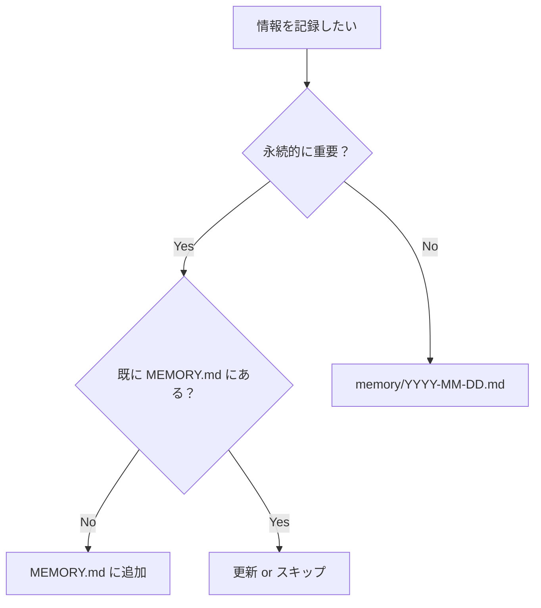
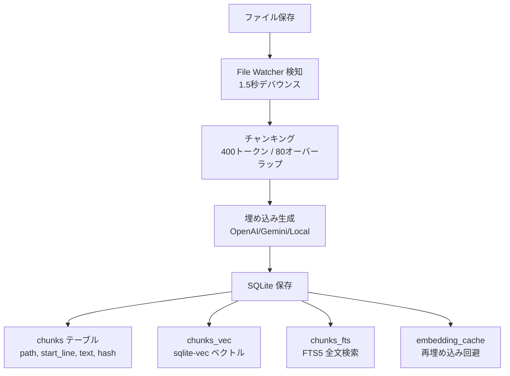
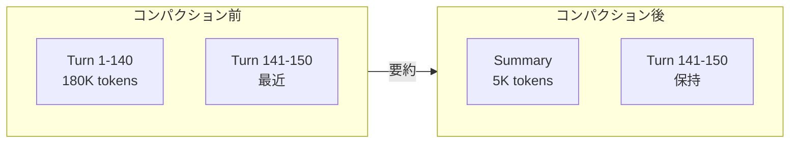
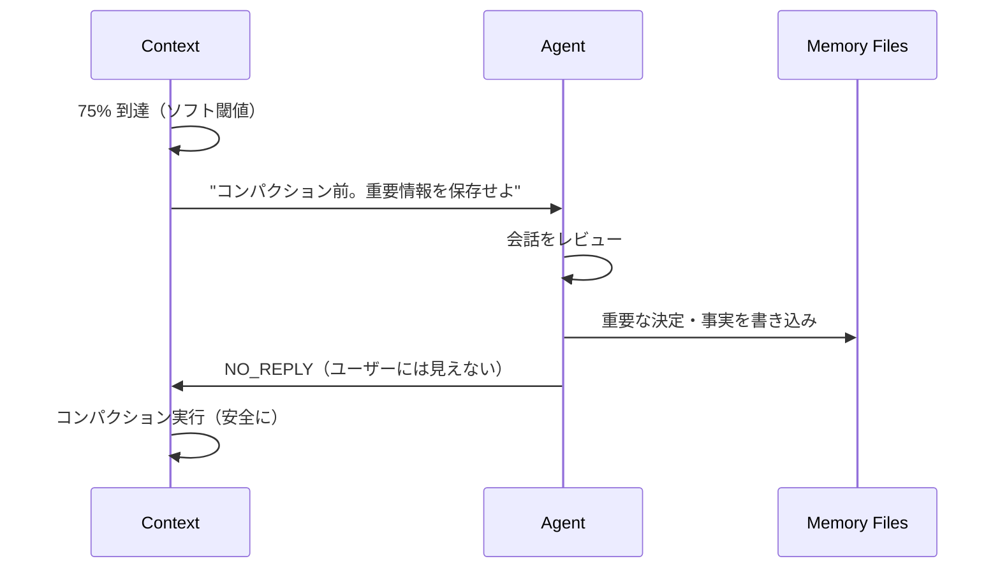

## はじめに

Clawdbot は GitHub 32,000+ スターのオープンソース AI アシスタント。Discord、WhatsApp、Telegram などと連携し、ローカルで動作する。

https://github.com/clawdbot/clawdbot

本記事では、Clawdbot のメモリシステムの内部実装を解説する。[Manthan Gupta 氏の解説記事](https://x.com/manthanguptaa/status/2015780646770323543)を参考にした。

## コンテキスト vs メモリ

まず重要な区別：

| | コンテキスト | メモリ |
|---|---|---|
| 存在 | リクエスト中のみ | ディスク上に永続 |
| サイズ | コンテキストウィンドウ制限（200K等） | 無制限 |
| コスト | トークン消費 | ストレージのみ |
| 検索 | なし | セマンティック検索可能 |

```
コンテキスト = システムプロンプト + 会話履歴 + ツール結果

メモリ = MEMORY.md + memory/*.md + セッション記録
```

## 2層メモリシステム

Clawdbot のメモリは2層構造：

```
~/clawd/
├── MEMORY.md              # Layer 2: 長期記憶（キュレーション済み）
└── memory/
    ├── 2026-01-27.md      # Layer 1: 今日のログ
    ├── 2026-01-26.md      # 昨日のログ
    └── ...
```

### Layer 1: 日次ログ（memory/YYYY-MM-DD.md）

Append-only の日次メモ。エージェントが1日を通して書き込む：

```markdown
# 2026-01-26

## 10:30 AM - API 議論
REST vs GraphQL を検討。決定: シンプルさ重視で REST。
主要エンドポイント: /users, /auth, /projects

## 2:15 PM - デプロイ
v2.3.0 を本番環境にデプロイ。問題なし。

## 4:00 PM - ユーザー好み
ユーザーは JavaScript より TypeScript を好む。
```

### Layer 1 → Layer 2 の移行条件

**自動移行はない。エージェントの判断に依存。**

AGENTS.md のガイドラインに基づいてエージェントが決める：



| 書き先 | 内容 | 例 |
|--------|------|-----|
| `memory/YYYY-MM-DD.md` | その日の出来事、作業ログ | 「10:30 API 議論した」 |
| `MEMORY.md` | 永続的な事実、好み、決定 | 「TypeScript を好む」 |

**MEMORY.md に行くもの：**
- ユーザーの好み・習慣
- プロジェクトの重要決定
- キーコンタクト情報
- 繰り返し参照される事実

**日次ログに留まるもの：**
- 一時的な作業記録
- デバッグ過程
- 1回限りのタスク

つまり**ルールベースではなく LLM の判断**に依存。これが「シンプルだけど実用的」な理由でもあり、限界でもある。

### Layer 2: 長期記憶（MEMORY.md）

キュレーション済みの永続知識：

```markdown
# Long-term Memory

## ユーザー好み
- TypeScript > JavaScript
- 簡潔な説明を好む
- プロジェクト「Acme Dashboard」を開発中

## 重要な決定
- 2026-01-15: DB は PostgreSQL
- 2026-01-20: REST over GraphQL
- 2026-01-26: CSS は Tailwind

## キーコンタクト
- Alice (alice@acme.com) - デザインリード
- Bob (bob@acme.com) - バックエンドエンジニア
```

## メモリツール

### memory_search

セマンティック検索でメモリを検索：

```json
{
  "query": "API について何を決めた？",
  "maxResults": 6,
  "minScore": 0.35
}
```

レスポンス：

```json
{
  "results": [{
    "path": "memory/2026-01-20.md",
    "startLine": 45,
    "endLine": 52,
    "score": 0.87,
    "snippet": "## API Discussion\nREST over GraphQL..."
  }]
}
```

### memory_get

検索後、特定の行を読み取り：

```json
{
  "path": "memory/2026-01-20.md",
  "from": 45,
  "lines": 15
}
```

### 書き込み

専用の `memory_write` ツールは**ない**。通常の `write` / `edit` ツールで Markdown を編集するだけ。手動編集も可能（自動で再インデックス）。

## インデックス構造

メモリファイルが保存されると：



**なぜ 400/80?**
- 400 トークン: 意味的まとまりを保つ
- 80 オーバーラップ: チャンク境界の事実を両方でキャプチャ

## ハイブリッド検索

2つの検索戦略を並列実行：

| 検索タイプ | 目的 | 実装 |
|-----------|------|------|
| **Vector** | 意味的類似性 | sqlite-vec |
| **BM25** | キーワード完全一致 | FTS5 |

スコア合成：

```
finalScore = (0.7 × vectorScore) + (0.3 × BM25Score)
```

**なぜ 70/30?**
- セマンティック検索が主（「あのデータベースの件」）
- BM25 がベクトルで漏れる正確な語をキャッチ（名前、ID、日付）

## コンパクション

コンテキストウィンドウ（Claude: 200K、GPT-5.1: 1M）に近づくと、古い会話を要約：



## メモリフラッシュ

コンパクションは**ロッシー**（情報が失われる）。対策として「メモリフラッシュ」：



コンパクションで失われる前に、重要情報をディスクに永続化。

## プルーニング

ツール結果は巨大になりがち（`exec` の 50,000 文字ログなど）。プルーニングで古い出力をトリム：

```
Before: [50,000文字の npm install 出力]
After:  "npm WARN deprecated...[truncated]...Successfully installed."
```

**Cache-TTL プルーニング**: Anthropic のキャッシュ TTL（5分）が切れた後にプルーニングし、再キャッシュコストを削減。

## マルチエージェント

エージェントごとにメモリは完全分離：

```
~/.clawdbot/memory/
├── main.sqlite      # "main" エージェント
└── work.sqlite      # "work" エージェント

~/clawd/             # main のワークスペース
~/clawd-work/        # work のワークスペース
```

用途例：
- "personal" エージェント → WhatsApp
- "work" エージェント → Slack

## 設計原則

Clawdbot メモリの成功要因：

### 1. 透明性
メモリは**プレーン Markdown**。読める、編集できる、git 管理できる。

### 2. 検索 > 注入
すべてをコンテキストに詰め込まず、必要なものだけ検索。コスト削減。

### 3. 永続性 > セッション
重要情報は会話履歴でなくファイルに保存。コンパクションで失われない。

### 4. ハイブリッド検索
ベクトル検索だけでは完全一致を逃す。キーワード検索だけでは意味を逃す。両方使う。

## 他ツールとの比較

| 観点 | Clawdbot | mem0 | SimpleMem |
|------|----------|------|-----------|
| ストレージ | Markdown + SQLite | Vector DB | LanceDB |
| 検索 | ハイブリッド（70/30） | ベクトル + グラフ | 3層（Semantic/Lexical/Symbolic） |
| 透明性 | ◎（ファイル編集可） | △ | △ |
| セットアップ | 簡単 | 複雑 | 中程度 |
| コスト | 低（ローカル） | 高（API依存） | 中 |

## まとめ

Clawdbot のメモリ実装の特徴：

- **2層構造**: 日次ログ + 長期記憶
- **ハイブリッド検索**: Vector 70% + BM25 30%
- **メモリフラッシュ**: コンパクション前の自動永続化
- **SQLite ベース**: sqlite-vec + FTS5
- **プレーン Markdown**: 透明性と編集可能性

「シンプルだが実用的」なアプローチ。複雑な RAG パイプラインなしで、ファイルベースのメモリが十分機能することを示している。

## 参考

- [How Clawdbot Remembers Everything](https://x.com/manthanguptaa/status/2015780646770323543) - Manthan Gupta
- [Clawdbot Documentation](https://docs.clawd.bot/)
- [GitHub Repository](https://github.com/clawdbot/clawdbot)

## 関連記事

- [AIエージェントのメモリ系プロジェクト比較（2026年1月）](/yasuhito/articles/ai-memory-projects-2026)
- [mem0: AIエージェントのためのメモリレイヤー](/yasuhito/articles/mem0-ai-memory-layer)
- [SimpleMem: 効率重視のLLMエージェントメモリ](/yasuhito/articles/simplemem-efficient-memory)
