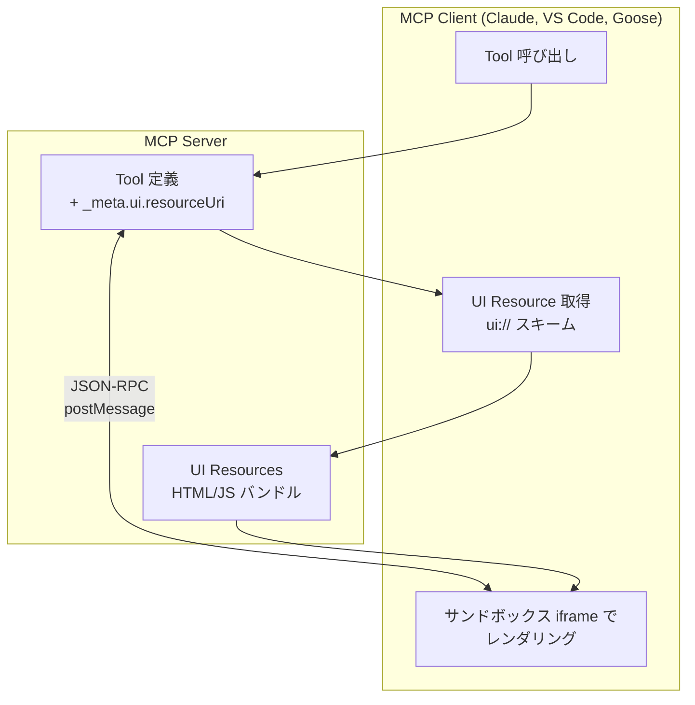

## MCP Apps とは

2026年1月、Anthropic が **MCP Apps** をリリースした。Model Context Protocol (MCP) の拡張機能で、AI チャット内に**インタラクティブな UI**を直接表示できる。

https://x.com/claudeai/status/2015851783655194640

従来の AI アシスタントはテキストや画像を返すだけだったが、MCP Apps により：

- 📊 **ダッシュボード**をチャット内に表示
- 📝 **フォーム**で複雑な設定を一括入力
- 🎮 **ゲーム**すら動作可能
- 📄 **PDF ビューア**でドキュメントをその場で確認

といったことが可能になる。

## なぜ Web アプリではなく MCP Apps なのか

「Web アプリへのリンクを返せばいいのでは？」と思うかもしれない。MCP Apps が優れている点：

| 観点 | Web アプリ | MCP Apps |
|------|-----------|----------|
| コンテキスト | タブ切り替えが必要 | 会話内で完結 |
| データ連携 | API・認証を別途実装 | MCP の既存パターンを活用 |
| 他ツール連携 | 個別に実装 | ホストの機能を委譲可能 |
| セキュリティ | 自前で担保 | サンドボックス iframe |

特に**コンテキスト保持**が強力。「売上データを見せて」→ ダッシュボード表示 → 「東京だけフィルタして」という流れが、画面遷移なしで実現できる。

## アーキテクチャ



処理フロー：

1. ツール定義に `_meta.ui.resourceUri` を追加
2. `ui://` スキームで HTML/JS を配信
3. ホストがサンドボックス iframe 内でレンダリング
4. JSON-RPC over postMessage で双方向通信

## デモ動画まとめ

X で見つけた印象的なデモを紹介する。

### 2D プラットフォーマーゲーム

Claude Desktop 内でゲームが動作。

https://x.com/banjtheman/status/2016337474260238737

### リアルタイムチェス

チャット内でチェス対戦が可能。

https://x.com/gching/status/2016045307948081595

### LIFX ライトコントロール

VS Code 内で照明をコントロールするパネル。AI が意図を汲み取れなかったときのフォールバック UI として活用。

https://x.com/burkeholland/status/2016208751200457088

### Yahoo Finance 株価データ

Cursor + Opus で株価データをインタラクティブに表示。

https://x.com/mirko_monti6/status/2016272708309492175

### Generative UI Playground

3種類の Generative UI（Static, Declarative, Open-Ended）を比較できるプレイグラウンド。

https://x.com/nathan_tarbert/status/2016205731805200525

## 対応クライアント

| クライアント | 対応状況 |
|-------------|---------|
| Claude (Web/Desktop) | ✅ 対応済み |
| VS Code Insiders | ✅ 対応済み |
| Goose | ✅ 対応済み（リファレンス実装） |
| ChatGPT | 🔜 対応予定 |

## 実装方法

### パッケージインストール

```bash
npm install @modelcontextprotocol/ext-apps
```

### サーバー側（TypeScript）

```typescript
import { McpServer } from "@modelcontextprotocol/sdk/server/mcp.js";
import { registerAppTool, registerAppResource } from "@modelcontextprotocol/ext-apps/server";

const server = new McpServer({
  name: "My MCP App Server",
  version: "1.0.0",
});

const resourceUri = "ui://my-tool/app.html";

// ツール登録（UI 付き）
registerAppTool(
  server,
  "my-tool",
  {
    title: "My Tool",
    description: "Does something cool",
    inputSchema: {},
    _meta: { ui: { resourceUri } },
  },
  async () => {
    return {
      content: [{ type: "text", text: "Result data" }],
    };
  }
);

// UI リソース登録
registerAppResource(
  server,
  resourceUri,
  resourceUri,
  { mimeType: "text/html" },
  async () => {
    const html = await fs.readFile("dist/app.html", "utf-8");
    return {
      contents: [{ uri: resourceUri, mimeType: "text/html", text: html }],
    };
  }
);
```

### クライアント側（HTML/JS）

```typescript
import { App } from "@modelcontextprotocol/ext-apps";

const app = new App({ name: "My App", version: "1.0.0" });
app.connect();

// ツール結果を受信
app.ontoolresult = (result) => {
  const data = result.content?.find((c) => c.type === "text")?.text;
  document.getElementById("result").textContent = data;
};

// サーバーツールを呼び出し
document.getElementById("btn").addEventListener("click", async () => {
  const result = await app.callServerTool({
    name: "my-tool",
    arguments: {},
  });
  // 結果を処理
});
```

## セキュリティ

MCP Apps のセキュリティ対策：

- **サンドボックス iframe**: 親ページへのアクセス不可
- **CSP 制御**: 読み込み可能な外部オリジンを制限
- **権限宣言**: カメラ・マイク等は事前宣言が必要
- **監査ログ**: JSON-RPC 通信のログ取得

ホスト側がサードパーティの MCP サーバーを安全にレンダリングできる設計。

## MCP Apps vs OpenAI Apps SDK

| 項目 | MCP Apps | OpenAI Apps SDK |
|------|----------|-----------------|
| プロトコル | オープン標準 | OpenAI 独自 |
| 対応クライアント | 複数 | ChatGPT のみ |
| 相互運用性 | 高い | 限定的 |

MCP はオープン標準として複数ベンダーが採用しており、一度作った MCP App は Claude でも VS Code でも動作する。

## 今後の可能性

MCP Apps の登場で、AI アシスタントの活用範囲が大きく広がる：

- **データ分析**: SQL 結果をその場でグラフ化
- **設計レビュー**: Figma デザインをチャット内で確認・コメント
- **承認ワークフロー**: 経費精算、PR レビューを UI 付きで処理
- **教育**: インタラクティブな教材をチャット内で提供
- **IoT 制御**: スマートホームデバイスのダッシュボード

「ブラウザタブが不要になる」という見方もあり、AI がユニバーサルコントローラとして動作する未来が見えてきた。

## まとめ

MCP Apps は、AI チャットをテキストベースの Q&A から**インタラクティブなアプリケーションプラットフォーム**へと進化させる技術。

- オープン標準で複数クライアント対応
- サンドボックスによる安全な実行
- 双方向データフローで既存ツールと連携

2026年は MCP がエンタープライズ標準として定着する年。MCP Apps はその中核機能として、今後ますます重要になっていく。

## 参考リンク

- [MCP Apps 公式ドキュメント](https://modelcontextprotocol.io/docs/extensions/apps)
- [MCP Apps 公式ブログ](https://blog.modelcontextprotocol.io/posts/2026-01-26-mcp-apps/)
- [ext-apps GitHub リポジトリ](https://github.com/modelcontextprotocol/ext-apps)
- [Awesome MCP Servers](https://github.com/punkpeye/awesome-mcp-servers)
