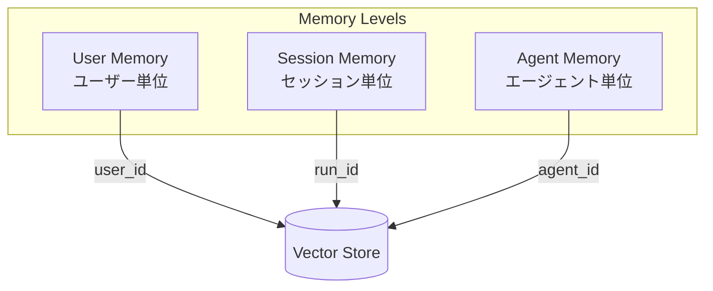
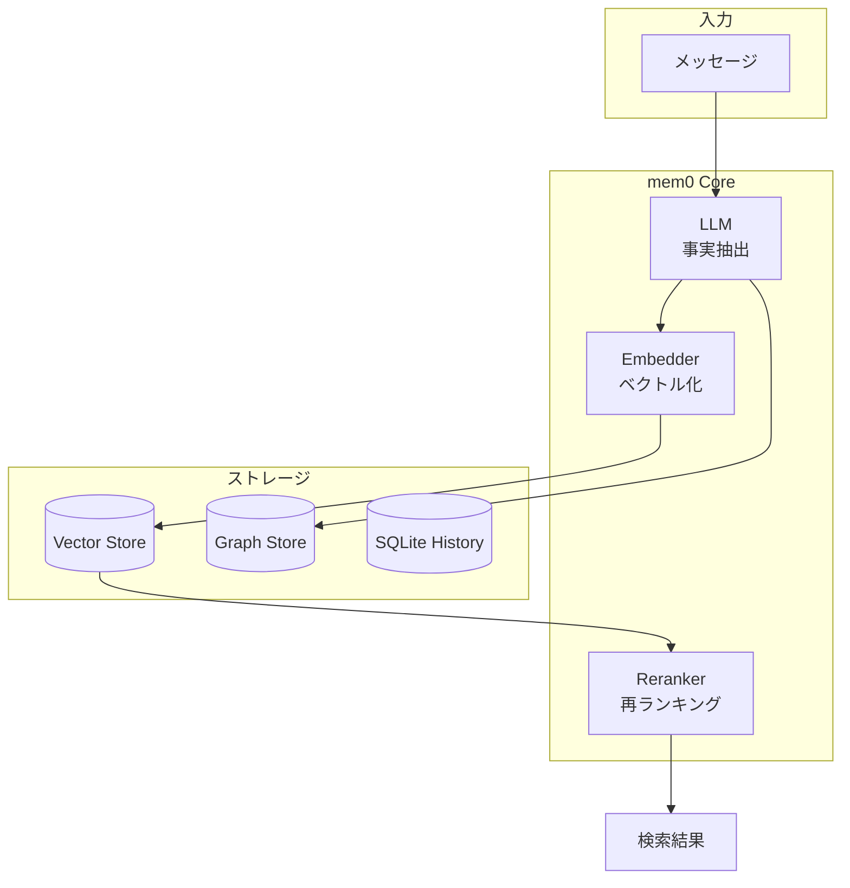

## mem0 とは

**mem0**（「メム・ゼロ」と読む）は、AIアシスタントやエージェントに永続的なメモリ機能を提供するオープンソースプロジェクト。GitHub スター数は約46,000で、AIメモリ系では最も人気がある。Y Combinator S24 出身。

https://github.com/mem0ai/mem0

コンセプトは「**The Memory Layer for Personalized AI**」。ユーザーの好みを記憶し、個々のニーズに適応し、時間とともに学習する。

## ベンチマーク結果

論文（arXiv:2504.19413）での LOCOMO ベンチマーク結果：

| 指標 | mem0 | 比較対象 |
|-----|------|---------|
| **精度** | +26% | vs OpenAI Memory |
| **レイテンシ** | -91% | vs フルコンテキスト |
| **トークン使用量** | -90% | vs フルコンテキスト |

フルコンテキストを送るより、mem0 でメモリを管理したほうが速くて安い。

## 3レベルのメモリ

mem0 は3つのレベルでメモリを管理：



| レベル | ID | 用途 |
|-------|-----|------|
| **User** | `user_id` | ユーザーの好み、履歴、プロファイル |
| **Session** | `run_id` | 特定の会話セッション内の文脈 |
| **Agent** | `agent_id` | エージェント固有の知識、設定 |

## 3種類のメモリタイプ

```python
from mem0.configs.enums import MemoryType

class MemoryType(Enum):
    SEMANTIC = "semantic_memory"    # 知識・概念
    EPISODIC = "episodic_memory"    # イベント・経験
    PROCEDURAL = "procedural_memory" # 手順・ワークフロー
```

MIRIX の6種類に比べるとシンプルな構成。

## アーキテクチャ



### Mem0ᵍ（グラフ拡張版）

通常の mem0 に加えて、**Neo4j** ベースのナレッジグラフを追加した拡張版。エンティティ間の関係性を保持し、マルチセッションにわたる複雑な関係を追跡。

## 豊富なインテグレーション

### Vector Store（25種類以上）

```
Pinecone, Qdrant, Chroma, Milvus, Weaviate,
pgvector, Redis, Elasticsearch, OpenSearch,
Supabase, MongoDB, Cassandra, FAISS,
Azure AI Search, Vertex AI, S3 Vectors...
```

### LLM（15種類以上）

```
OpenAI, Anthropic, Gemini, Groq, DeepSeek,
AWS Bedrock, Azure OpenAI, Ollama, LMStudio,
LiteLLM, vLLM, Together, xAI...
```

### Embedder

OpenAI, Gemini, Ollama, Azure, HuggingFace など

## 基本的な使い方

```python
from openai import OpenAI
from mem0 import Memory

openai_client = OpenAI()
memory = Memory()

def chat_with_memories(message: str, user_id: str) -> str:
    # 関連メモリを検索
    relevant_memories = memory.search(
        query=message, 
        user_id=user_id, 
        limit=3
    )
    memories_str = "\n".join(
        f"- {entry['memory']}" 
        for entry in relevant_memories["results"]
    )

    # システムプロンプトにメモリを含める
    system_prompt = f"""You are a helpful AI.
User Memories:
{memories_str}"""
    
    messages = [
        {"role": "system", "content": system_prompt},
        {"role": "user", "content": message}
    ]
    
    # LLM で応答生成
    response = openai_client.chat.completions.create(
        model="gpt-4.1-nano-2025-04-14",
        messages=messages
    )
    assistant_response = response.choices[0].message.content

    # 会話をメモリに追加
    messages.append({"role": "assistant", "content": assistant_response})
    memory.add(messages, user_id=user_id)

    return assistant_response
```

## OpenMemory（MCP サーバー）

コーディングエージェント向けの MCP サーバー。Claude Code や Cursor などと統合し、「あなたのコーディングスタイル」を学習する。

- プロジェクトスコープでのメモリ取得
- アクセスログによる監査・プライバシー制御
- 月額 $4.99〜のサブスクリプション

## ホスト版 vs セルフホスト

| | ホスト版 | セルフホスト |
|--|---------|------------|
| **セットアップ** | API キー取得のみ | インフラ構築必要 |
| **更新** | 自動 | 手動 |
| **分析** | 組み込み | 自前実装 |
| **料金** | 従量課金 | インフラ費用のみ |

```bash
# セルフホスト版インストール
pip install mem0ai

# npm版
npm install mem0ai
```

## 他ツールとの比較

| 観点 | mem0 | claude-mem | MIRIX |
|------|------|------------|-------|
| **アプローチ** | 汎用メモリレイヤー | Claude Code 特化 | 画面キャプチャ |
| **メモリ種類** | 3種類 | 1種類（観察） | 6種類 |
| **グラフDB** | ✅ Neo4j | ❌ | ❌ |
| **インテグレーション** | 25+ Vector Store | SQLite + Chroma | PostgreSQL |
| **ホスト版** | ✅ | ❌ | ✅ |

## 注意点

### トークンコスト

メモリの抽出・検索には LLM を使用するため、API コストが発生。ただし論文によれば、フルコンテキストより90%削減可能。

### 設定の複雑さ

豊富なインテグレーションの裏返しとして、設定項目が多い：

```python
from mem0 import Memory

config = {
    "vector_store": {
        "provider": "qdrant",
        "config": {
            "collection_name": "my_memories",
            "host": "localhost",
            "port": 6333,
        }
    },
    "llm": {
        "provider": "openai",
        "config": {
            "model": "gpt-4o-mini",
            "temperature": 0,
        }
    },
    "embedder": {
        "provider": "openai",
        "config": {
            "model": "text-embedding-3-small"
        }
    },
    "graph_store": {
        "provider": "neo4j",
        "config": {
            "url": "neo4j+s://xxx",
            "username": "neo4j",
            "password": "xxx"
        }
    }
}

memory = Memory.from_config(config)
```

### 依存関係

インテグレーションごとに追加パッケージが必要：

```bash
pip install mem0ai[qdrant]
pip install mem0ai[neo4j]
```

## まとめ

mem0 の特徴：

- **3レベルメモリ** - User / Session / Agent
- **グラフ拡張** - Mem0ᵍ で Neo4j 連携
- **豊富なインテグレーション** - 25+ Vector Store、15+ LLM
- **ベンチマーク実績** - LOCOMO で +26% 精度
- **ホスト版あり** - すぐに始められる

YC 出身で最もスター数が多く、プロダクション利用を想定した設計。エンタープライズでの採用事例も増えている。

シンプルに始めたいなら MEMORY.md 手動管理、本格的にやるなら mem0、というのが現実的な選択肢。

## 関連記事

- [claude-mem: Claude Code に永続メモリを追加する](/yasuhito/articles/claude-mem-persistent-memory)
- [MIRIX: 6種のメモリを持つマルチエージェント記憶システム](/yasuhito/articles/mirix-multi-agent-memory)
