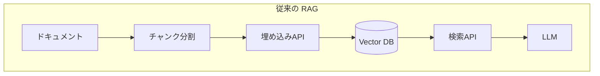
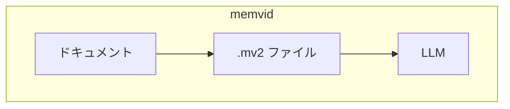
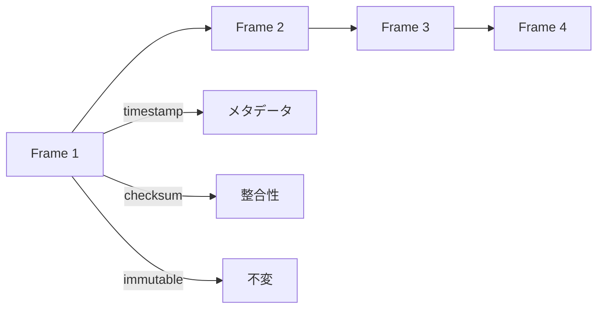

## memvid とは

**memvid** は、AIエージェントのためのシングルファイル型メモリシステム。GitHub スター数は約12,600、Rust 製。

https://github.com/memvid/memvid

コンセプトは「**複雑な RAG パイプラインを、サーバーレスなシングルファイルに置き換える**」。データ、埋め込み、検索インデックス、メタデータをすべて1つの `.mv2` ファイルに格納する。

## なぜ memvid か

従来の RAG アプローチとの比較：





| 観点 | 従来の RAG | memvid |
|------|-----------|--------|
| インフラ | Vector DB、API サーバー | **不要** |
| セットアップ | 複数サービス構成 | **ファイル1つ** |
| ポータビリティ | サーバー依存 | **ファイルを渡すだけ** |
| 検索速度 | ネットワーク遅延あり | **サブ5ms（ローカル）** |

## Smart Frames

memvid のコア概念は「**Smart Frames**」。動画エンコーディングにインスパイアされた設計：



**Smart Frame の特徴：**
- **Append-only** - 既存データを変更せずに追記
- **イミュータブル** - 書き込み後は変更不可
- **タイムスタンプ付き** - 時系列で追跡可能
- **チェックサム** - データ整合性を保証

これにより：
- クラッシュセーフ
- 過去の状態にクエリ可能
- 知識の変遷を追跡可能

## .mv2 ファイル構造

すべてが1つのファイルに：

```
┌────────────────────────────┐
│ Header (4KB)               │  マジック、バージョン
├────────────────────────────┤
│ Embedded WAL (1-64MB)      │  クラッシュリカバリ
├────────────────────────────┤
│ Data Segments              │  圧縮されたフレーム
├────────────────────────────┤
│ Lex Index                  │  全文検索（Tantivy）
├────────────────────────────┤
│ Vec Index                  │  ベクトル検索（HNSW）
├────────────────────────────┤
│ Time Index                 │  時系列インデックス
├────────────────────────────┤
│ TOC (Footer)               │  セグメントオフセット
└────────────────────────────┘
```

**サイドカーファイルなし**：`.wal`、`.lock`、`.shm` などは一切不要。

## 主要機能

### 1. タイムトラベルデバッグ

過去のメモリ状態に巻き戻し、リプレイ、分岐が可能：

```rust
// 過去の状態にクエリ
let response = mem.search(SearchRequest {
    query: "planning".into(),
    at_timestamp: Some(past_timestamp),
    ..Default::default()
})?;
```

### 2. マルチモーダル対応

| 機能 | Feature Flag | 説明 |
|------|-------------|------|
| 全文検索 | `lex` | BM25 ランキング（Tantivy） |
| ベクトル検索 | `vec` | HNSW + ローカル埋め込み（ONNX） |
| 画像検索 | `clip` | CLIP ビジュアル埋め込み |
| 音声文字起こし | `whisper` | Whisper 音声認識 |
| 暗号化 | `encryption` | パスワードベース暗号化（.mv2e） |

### 3. ローカル埋め込み

クラウド API 不要でベクトル検索：

```bash
# モデルダウンロード
curl -L 'https://huggingface.co/BAAI/bge-small-en-v1.5/resolve/main/onnx/model.onnx' \
  -o ~/.cache/memvid/text-models/bge-small-en-v1.5.onnx
```

| モデル | 次元数 | サイズ | 用途 |
|--------|--------|--------|------|
| bge-small-en-v1.5 | 384 | ~120MB | 高速（デフォルト） |
| bge-base-en-v1.5 | 768 | ~420MB | 高品質 |
| gte-large | 1024 | ~1.3GB | 最高品質 |

## SDK

マルチ言語対応：

```bash
# CLI
npm install -g memvid-cli

# Node.js
npm install @memvid/sdk

# Python
pip install memvid-sdk

# Rust
cargo add memvid-core
```

## 使用例

```rust
use memvid_core::{Memvid, PutOptions, SearchRequest};

fn main() -> memvid_core::Result<()> {
    // メモリファイル作成
    let mut mem = Memvid::create("knowledge.mv2")?;

    // ドキュメント追加
    let opts = PutOptions::builder()
        .title("Meeting Notes")
        .tag("project", "alpha")
        .build();
    mem.put_bytes_with_options(b"Q4 planning discussion...", opts)?;
    mem.commit()?;

    // 検索
    let response = mem.search(SearchRequest {
        query: "planning".into(),
        top_k: 10,
        snippet_chars: 200,
        ..Default::default()
    })?;

    for hit in response.hits {
        println!("{}: {}", hit.title.unwrap_or_default(), hit.text);
    }

    Ok(())
}
```

## ユースケース

- **長時間稼働エージェント** - ポータブルなメモリを持ち運び
- **オフラインファースト** - インターネット接続不要
- **コードベース理解** - リポジトリ全体をメモリ化
- **監査可能な AI** - タイムトラベルでデバッグ
- **エッジデバイス** - 軽量でローカル動作

## 他ツールとの比較

| 観点 | mem0 | memvid |
|------|------|--------|
| アーキテクチャ | サーバー + DB | **シングルファイル** |
| 言語 | Python | **Rust** |
| 検索速度 | ネットワーク依存 | **サブ5ms** |
| ポータビリティ | 低 | **高（ファイル渡すだけ）** |
| セットアップ | 複雑 | **シンプル** |
| クラウド依存 | あり（API埋め込み等） | **なし（ローカル埋め込み）** |

## 注意点

### Rust エコシステム

Python/Node SDK はあるが、コア機能は Rust。パフォーマンス重視だが、Rust に慣れてないと拡張が難しい。

### 新しいプロジェクト

mem0（46k stars）に比べると歴史が浅い。プロダクション実績はまだ少ない。

### シングルファイルの限界

巨大なデータセット（数百GB以上）には分散システムが必要になる可能性。

## まとめ

memvid の特徴：

- **シングルファイル** - インフラ不要、ポータブル
- **Smart Frames** - 動画エンコーディング着想の効率的構造
- **タイムトラベル** - 過去の状態にクエリ可能
- **ローカル埋め込み** - クラウド API 不要
- **マルチモーダル** - テキスト、画像、音声対応
- **Rust 製** - 高速（サブ5ms検索）

「RAG パイプラインは複雑すぎる」と感じるなら、memvid は魅力的な選択肢。ファイル1つで完結する簡潔さが特徴。

## 関連記事

- [mem0: AIエージェントのためのメモリレイヤー](/yasuhito/articles/mem0-ai-memory-layer)
- [MIRIX: 6種のメモリを持つマルチエージェント記憶システム](/yasuhito/articles/mirix-multi-agent-memory)
- [claude-mem: Claude Code に永続メモリを追加する](/yasuhito/articles/claude-mem-persistent-memory)
