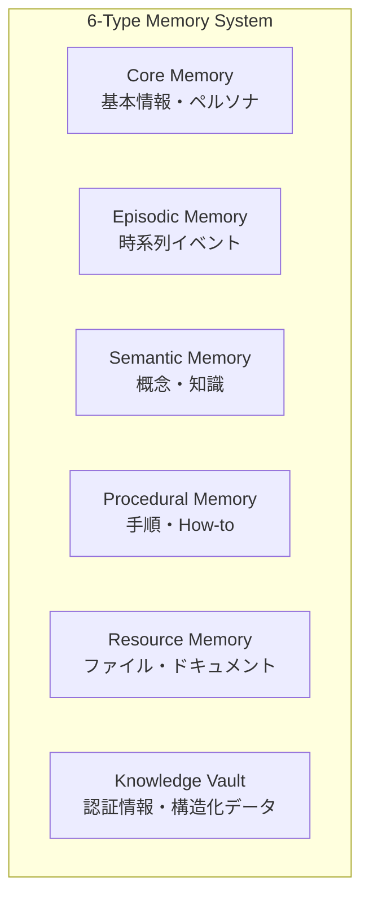
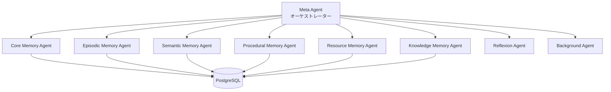
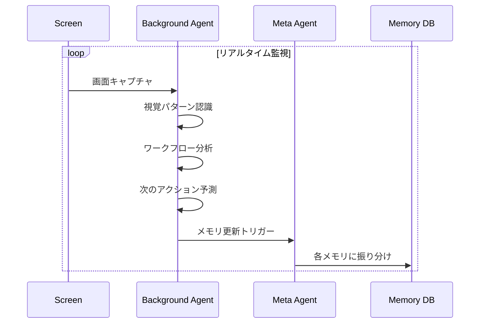

## MIRIX とは

**MIRIX** は、画面キャプチャから自動的にコンテキストを抽出し、6種類のメモリで管理するマルチエージェントシステム。GitHub スター数は約3,500、arXiv で論文も公開されている。

https://github.com/Mirix-AI/MIRIX

特徴的なのは「画面を見て覚える」アプローチ。ユーザーの画面をリアルタイムで観察し、その視覚情報から自動的にメモリを構築する。

## 6種類のメモリ

MIRIX は人間の記憶構造を模倣した6種類のメモリを持つ：



| メモリタイプ | 役割 | 例 |
|------------|------|-----|
| **Core** | ユーザーの基本情報、AIのペルソナ | 名前、性格、好み |
| **Episodic** | 時系列イベント（日記） | 「昨日友人とディナー」 |
| **Semantic** | 概念・一般知識 | 新しいソフト名、人物情報 |
| **Procedural** | 手順・ガイド | 「〇〇のやり方」 |
| **Resource** | ファイル・参照資料 | プロジェクト関連ドキュメント |
| **Knowledge** | 構造化データ | 電話番号、APIキー、URL |

### Semantic vs Knowledge の違い

よく混同されがちな2つ：

- **Knowledge** = 「John の電話番号は？」→ `555-1234`（事実）
- **Semantic** = 「John って誰？」→ 「開発チームを統括するPM」（理解）

## マルチエージェントアーキテクチャ

各メモリタイプに専用エージェントが割り当てられる：



### 各エージェントの役割

- **Meta Agent** - 全エージェントを統括、メモリ操作を調整
- **Memory Agents (6種)** - 各メモリタイプの更新・検索を担当
- **Reflexion Agent** - メモリの品質を評価、改善提案
- **Background Agent** - 画面監視、予測分析

## 画面キャプチャ機能

MIRIX のユニークな点は **Background Agent** による画面監視：



### Background Agent の能力

1. **視覚的アクティビティ認識** - アプリ、ワークフロー、タスクを識別
2. **インターフェース分析** - UIインタラクションを理解
3. **コンテキスト推論** - 視覚的手がかりからユーザーの意図を推測
4. **ワークフロー追跡** - マルチステップ処理を監視、次を予測
5. **注意パターン分析** - ナビゲーション行動を分析

### 予測カテゴリ

| 予測範囲 | 例 |
|---------|-----|
| **即時 (30秒〜5分)** | 次のクリック、テキスト入力、フォーム完了 |
| **短期 (5分〜1時間)** | アプリ切り替え、ファイル操作、メール作成 |
| **パターン (1〜6時間)** | ワークフローサイクル、休憩タイミング |

## ベンチマーク結果

論文（arXiv:2507.07957）での評価結果：

| ベンチマーク | MIRIX | ベースライン | 改善 |
|------------|-------|------------|------|
| **ScreenshotVQA** | - | RAG | +35% 精度向上 |
| **LOCOMO** | 85.4% | 従来手法 | SOTA達成 |

**ScreenshotVQA**：
- 約20,000枚の高解像度スクリーンショットを含むマルチモーダルベンチマーク
- ストレージ要件を **99.9% 削減**（RAG比）

## インストール

```bash
# PyPI からインストール
pip install mirix==0.1.6

# ローカル実行（バックエンド + ダッシュボード）
pip install -r requirements.txt
python scripts/start_server.py  # ターミナル1
cd dashboard && npm install && npm run dev  # ターミナル2
```

- ダッシュボード: http://localhost:5173
- API: http://localhost:8531

## 使用例

```python
from mirix import MirixClient

client = MirixClient(api_key="your_api_key")

# Meta Agent を初期化
client.initialize_meta_agent(
    config={
        "llm_config": {
            "model": "gpt-4o-mini",
            "model_endpoint_type": "openai",
        },
        "meta_agent_config": {
            "agents": [
                "core_memory_agent",
                "episodic_memory_agent",
                "semantic_memory_agent",
                "procedural_memory_agent",
                "resource_memory_agent",
                "knowledge_memory_agent",
                "reflexion_agent",
                "background_agent",
            ],
            "memory": {
                "core": [
                    {"label": "human", "value": ""},
                    {"label": "persona", "value": "I am a helpful assistant."},
                ],
                "decay": {
                    "fade_after_days": 30,
                    "expire_after_days": 90,
                },
            },
        },
    }
)

# メモリに追加
client.add(
    user_id="demo-user",
    messages=[
        {"role": "user", "content": [{"type": "text", "text": "明日の会議は10時から"}]},
        {"role": "assistant", "content": [{"type": "text", "text": "了解しました"}]},
    ],
)

# メモリから検索
memories = client.retrieve_with_conversation(
    user_id="demo-user",
    messages=[
        {"role": "user", "content": [{"type": "text", "text": "最近の予定は？"}]},
    ],
    limit=5,
)
```

## メモリの減衰（Decay）

MIRIX はメモリの自然な忘却をシミュレート：

```yaml
decay:
  fade_after_days: 30   # 30日後から薄れ始める
  expire_after_days: 90 # 90日後に完全削除
```

これにより：
- 古い情報が自動的に整理される
- ストレージが無限に膨らまない
- 関連性の高い情報が優先される

## プライバシー

- **ローカルファースト** - すべての長期データはローカル保存
- **ユーザー制御** - プライバシー設定をユーザーが管理
- **画面監視の制御** - Background Agent は無効化可能

## 注意点

### バージョン分岐

- **main ブランチ (0.1.6〜)** - 純粋なメモリシステム（他のエージェントに組み込み可能）
- **desktop-agent ブランチ (〜0.1.3)** - デスクトップアプリ版（非推奨）

### リソース消費

- 6つのエージェントが並行動作 → LLM API コスト
- 画面監視 → CPU/メモリ使用
- PostgreSQL + ベクトル検索 → ストレージ

シンプルなメモリが必要なら、他のソリューション（MEMORY.md 手動管理など）も検討すべき。

## まとめ

MIRIX の特徴：

- **6種類のメモリ** - 人間の記憶構造を模倣
- **マルチエージェント** - 各メモリに専用エージェント
- **画面キャプチャ** - 視覚情報から自動でメモリ構築
- **予測分析** - 次のアクションを予測
- **学術的裏付け** - arXiv 論文、ベンチマーク SOTA

「画面を見て覚える」というユニークなアプローチで、ユーザーの作業を暗黙的に学習する。リソース消費は大きいが、本格的なパーソナルAIを目指すなら検討の価値あり。

## 関連記事

- [PAI: 人間中心のAIエージェント基盤を理解する](/yasuhito/articles/pai-personal-ai-infrastructure)
- [claude-mem: Claude Code に永続メモリを追加する](/yasuhito/articles/claude-mem-persistent-memory)
