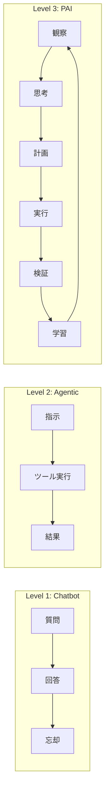
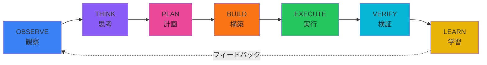
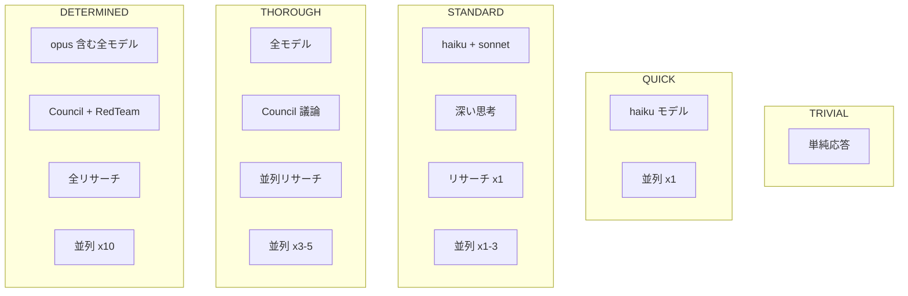
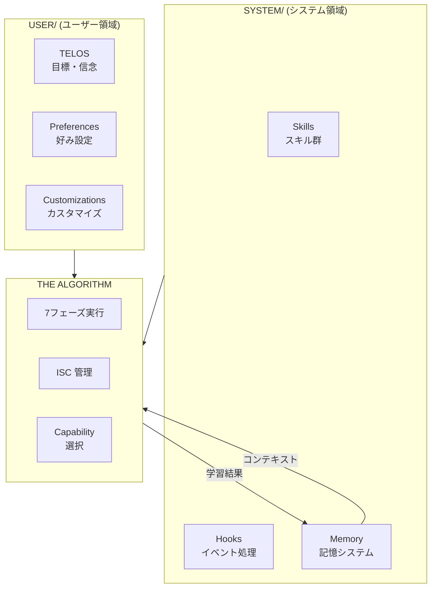
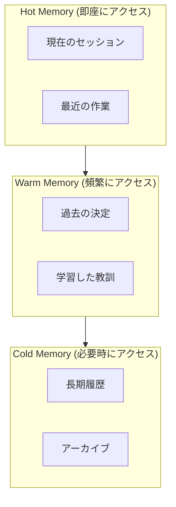
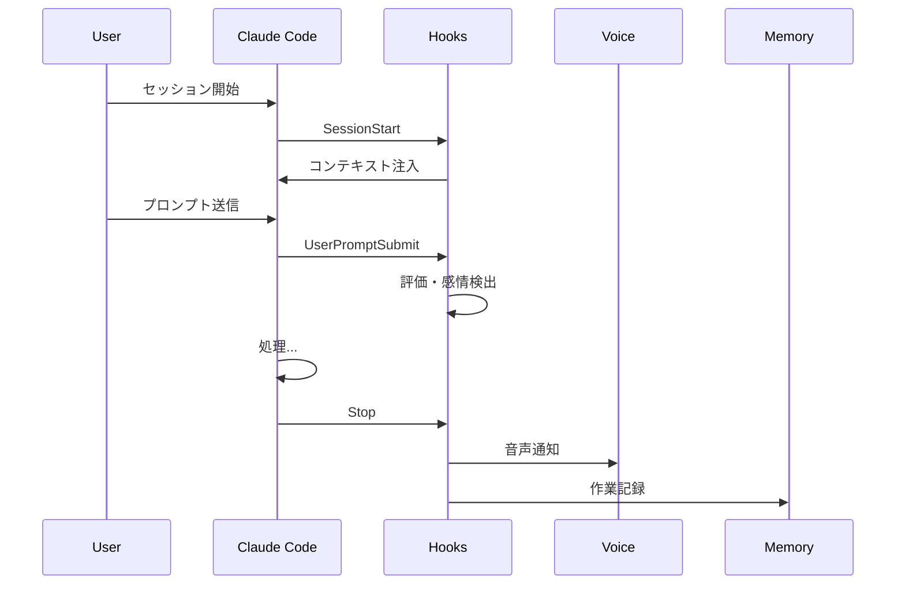

## PAI とは

**PAI (Personal AI Infrastructure)** は、Daniel Miessler が開発したオープンソースのAIエージェント基盤。GitHub スター数は約6,000で、YC出身の mem0 とは異なるアプローチを取っている。

コンセプトは「**AI should magnify everyone—not just the top 1%**」。技術エリートだけでなく、すべての人が高品質なAIインフラにアクセスできるようにすることを目指している。

## AI システムの3つのレベル

PAI は AI システムを3段階で捉えている：



| レベル | 例 | 特徴 |
|--------|-----|------|
| Chatbot | ChatGPT, Claude | 会話ごとにリセット。ユーザーを覚えない |
| Agentic | Claude Code, Cursor | ツール実行可能。でもユーザーの目標は知らない |
| PAI | - | ユーザーの目標・好み・履歴を理解し、継続的に学習 |

## PAI の核心：THE ALGORITHM

PAI の実行エンジンは「THE ALGORITHM」と呼ばれる7フェーズの処理ループ。



各フェーズの役割：

1. **OBSERVE** - リクエストとユーザーコンテキストを理解、ISC（後述）を作成
2. **THINK** - 不足がないか確認、ISC を補完
3. **PLAN** - タスクの順序付けとケイパビリティ割り当て
4. **BUILD** - 各行をテスト可能な形に具体化
5. **EXECUTE** - 適切なエージェントで作業実行
6. **VERIFY** - 完了した各行を懐疑的にテスト
7. **LEARN** - 結果を出力し、ユーザー評価を取得

## ISC: Ideal State Criteria（理想状態の基準）

PAI の特徴的な概念が **ISC テーブル**。「理想の状態とは何か」を明示的に定義する。

```markdown
| # | What Ideal Looks Like | Source | Capability | Status |
|---|----------------------|--------|------------|--------|
| 1 | パターンのリサーチ完了 | INFERRED | research | PENDING |
| 2 | トグルコンポーネント動作 | EXPLICIT | engineer | ACTIVE |
| 3 | テーマ状態が永続化 | EXPLICIT | engineer | PENDING |
| 4 | TypeScript で実装 | INFERRED | - | DONE |
| 5 | テスト通過 | IMPLICIT | qa_tester | PENDING |
```

Source の種類：
- **EXPLICIT** - ユーザーが明示的に要求
- **INFERRED** - コンテキストから推論
- **IMPLICIT** - 暗黙の品質基準

## Effort レベルと Capability

タスクの複雑さに応じて使用するリソースが変わる：



## TELOS: ユーザーの目標理解

PAI は10個のファイルでユーザーを理解する：

```
USER/TELOS/
├── MISSION.md      # 人生のミッション
├── GOALS.md        # 現在の目標
├── PROJECTS.md     # 進行中プロジェクト
├── BELIEFS.md      # 信念・価値観
├── MODELS.md       # メンタルモデル
├── STRATEGIES.md   # 戦略
├── NARRATIVES.md   # 自己物語
├── LEARNED.md      # 学んだこと
├── CHALLENGES.md   # 課題
└── IDEAS.md        # アイデア
```

これにより AI は「このユーザーが何を達成しようとしているか」を常に把握できる。

## アーキテクチャ全体像



**USER/SYSTEM 分離の利点：**
- PAI アップグレード時にユーザーファイルは影響を受けない
- ポータブルなアイデンティティ

## Memory システム

3層構造でメモリを管理：



毎インタラクションで以下をキャプチャ：
- 評価（明示的: "8点" / 暗黙的: 感情分析）
- 成功・失敗パターン
- ユーザーの好み

## Hook システム

Claude Code のライフサイクルイベントに応答：



主要イベント：
- **SessionStart** - PAI コンテキストをロード
- **UserPromptSubmit** - 評価検出、タブタイトル更新
- **Stop** - 音声通知、作業キャプチャ

## 他ツールとの違い

| 観点 | Claude Code | Cursor | PAI |
|------|-------------|--------|-----|
| フォーカス | ツール | IDE統合 | **人間** |
| メモリ | セッション内 | プロジェクト | **継続的学習** |
| 目標理解 | なし | なし | **TELOS** |
| 実行方法 | アドホック | アドホック | **THE ALGORITHM** |

## まとめ

PAI の特徴：

- **Goal Orientation** - ユーザーの目標が最優先
- **Pursuit of Optimal Output** - 状況に応じた最適出力を追求
- **Continuous Learning** - 継続的な学習とフィードバック

従来の「ツール中心」のAIエージェントとは一線を画す「人間中心」のアプローチ。目標を持ったユーザーを AI で拡張する、という思想が貫かれている。

## リンク

- [GitHub](https://github.com/danielmiessler/PAI)
- [作者のブログ: The Real Internet of Things](https://danielmiessler.com/blog/real-internet-of-things)
