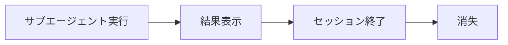
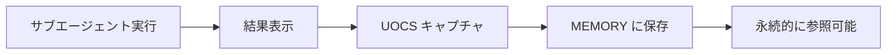
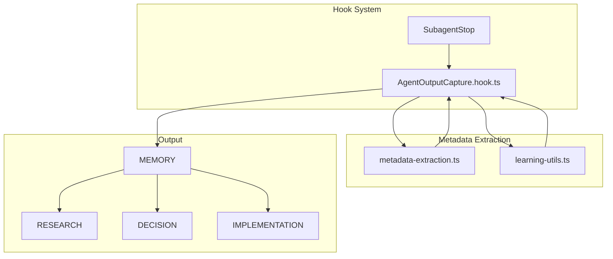
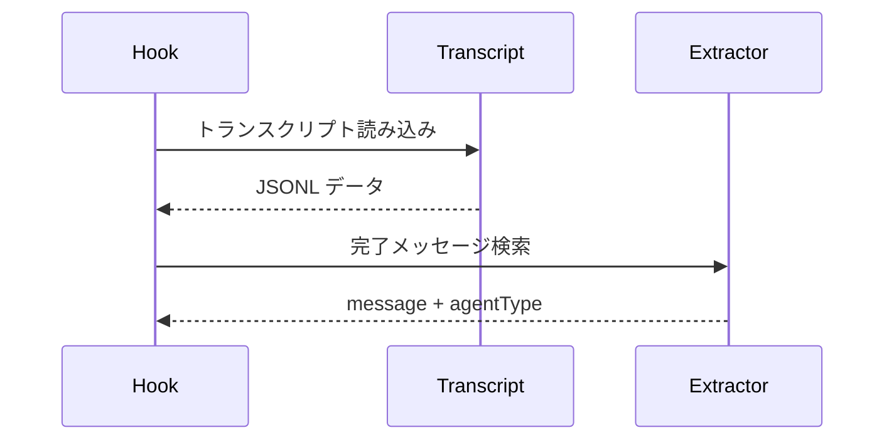
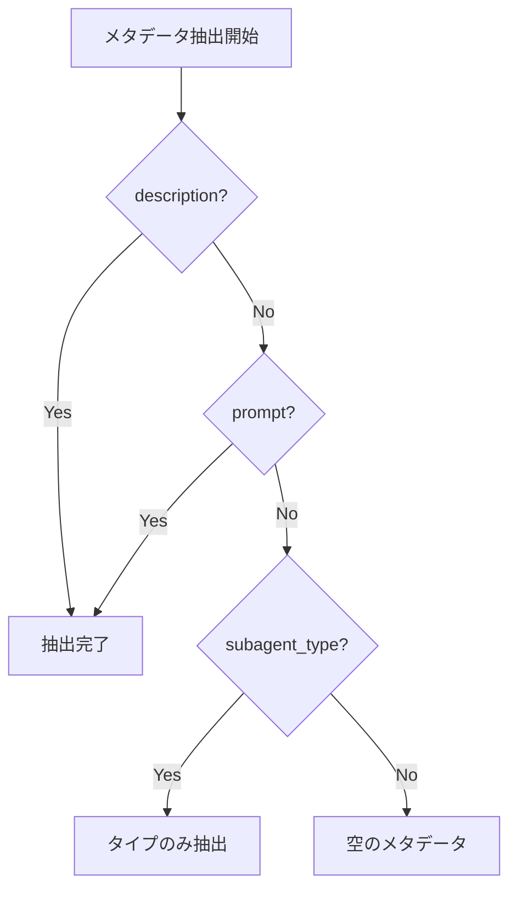
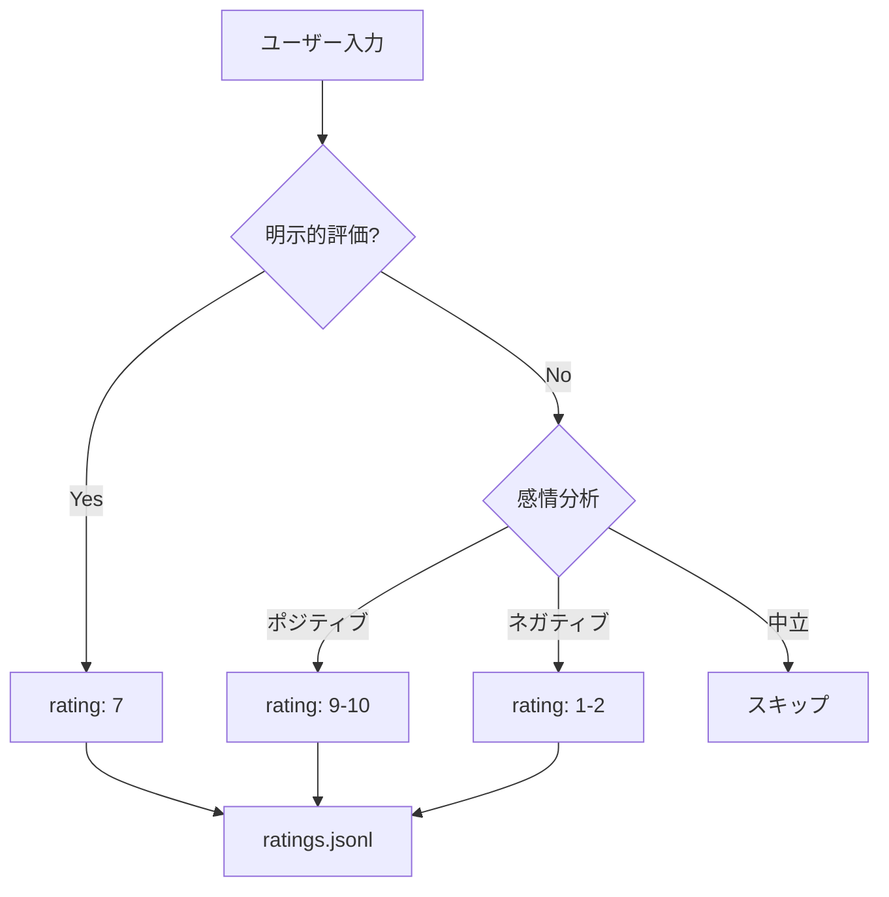

## UOCS とは

**UOCS (User Output Capture System)** は、PAI (Personal AI Infrastructure) におけるエージェント出力の自動キャプチャシステム。サブエージェントの実行結果を自動的に分類・保存し、後から参照可能にする。

## なぜ UOCS が必要か

AIエージェントは複数のサブエージェント（Researcher, Architect, Engineer など）を並行して動かすことがある。問題は：

- サブエージェントの出力が**揮発性**（セッション終了で消える）
- 後から「あのリサーチ結果どこ？」となる
- 学習のためのフィードバックループが構築できない

**UOCS なし：**


**UOCS あり：**


## アーキテクチャ



## 処理フロー

### 1. SubagentStop イベントの検知

Claude Code の Hook システムが、サブエージェント完了時に `SubagentStop` イベントを発火：

```typescript
// settings.json での Hook 設定
{
  "SubagentStop": [
    {
      "hooks": [{
        "type": "command",
        "command": "${PAI_DIR}/hooks/AgentOutputCapture.hook.ts"
      }]
    }
  ]
}
```

### 2. トランスクリプト解析

完了メッセージを2つのフォーマットで検索：

```typescript
// 新フォーマット（推奨）
🗣️ AgentName: [completion message]

// レガシーフォーマット（後方互換）
🎯 COMPLETED: [AGENT:type] [message]
```



### 3. メタデータ抽出

エージェントインスタンスの識別情報を抽出：

```typescript
interface AgentInstanceMetadata {
  agent_instance_id?: string;   // "perplexity-researcher-1"
  agent_type?: string;          // "perplexity-researcher"
  instance_number?: number;     // 1
  parent_session_id?: string;   // 親セッション ID
  parent_task_id?: string;      // 親タスク ID
}
```

抽出戦略（優先順位順）：

1. **description から** `[agent-type-N]` パターン
2. **prompt から** `[AGENT_INSTANCE: agent-type-N]` パターン
3. **subagent_type** フィールド（フォールバック）



### 4. カテゴリ分類

エージェントタイプに基づいて保存先を決定：

| エージェントタイプ | カテゴリ | 用途 |
|------------------|---------|------|
| researcher | RESEARCH | リサーチ結果 |
| architect | DECISION | 設計判断 |
| engineer | IMPLEMENTATION | 実装詳細 |
| designer | DESIGN | デザイン案 |
| pentester | SECURITY | セキュリティ分析 |
| intern | RESEARCH | 調査作業 |

### 5. ファイル保存

構造化されたMarkdownファイルとして保存：

```
MEMORY/
└── RESEARCH/
    └── 2026-01/
        └── 2026-01-27-143052_AGENT-researcher_RESEARCH_api-authentication-patterns.md
```

ファイル内容：

```markdown
---
capture_type: RESEARCH
timestamp: 2026-01-27 14:30:52 PST
executor: researcher
agent_completion: API認証パターンのリサーチ完了
---

# RESEARCH: API認証パターンのリサーチ完了

**Agent:** researcher
**Completed:** 2026-01-27 14:30:52

---

## Agent Output

[エージェントの完全な出力がここに]

---

## Metadata

**Transcript:** `/path/to/transcript.jsonl`
**Captured:** 2026-01-27 14:30:52 PST

---

*This output was automatically captured by UOCS SubagentStop hook.*
```

## 学習シグナルのキャプチャ

UOCS は出力保存だけでなく、学習シグナルも捕捉する：

### 明示的評価

```typescript
// ExplicitRatingCapture.hook.ts
// ユーザーが "7" や "8 - good work" と入力した時に検知

Pattern: /^(\d{1,2})(?:\s*[-–]\s*(.+))?$/
```

### 暗黙的感情

```typescript
// ImplicitSentimentCapture.hook.ts
// "What the fuck, you broke it!" → rating 1-2
// "Oh my god, this is amazing!" → rating 9-10
```



### 学習カテゴリ分類

低評価（< 6）は自動的に学習機会としてキャプチャ：

```typescript
function getLearningCategory(content: string): 'SYSTEM' | 'ALGORITHM' {
  // SYSTEM = hook失敗、ツール問題、インフラ
  // ALGORITHM = タスク実行、アプローチ、手法
  
  // デフォルトは ALGORITHM（タスク品質に関する学習が多い）
}
```

## Observability 連携

UOCS は Observability ダッシュボードにもイベントを送信：

```typescript
await sendEventToObservability({
  source_app: getSourceApp(),
  session_id: parsed.session_id,
  hook_event_type: 'SubagentStop',
  timestamp: getCurrentTimestamp(),
  agent_type: finalAgentType,
  agent_instance_id: metadata.agent_instance_id,
  summary: completionMessage,
});
```

これにより、リアルタイムでエージェント活動をモニタリングできる。

## バックグラウンドエージェント通知

`run_in_background: true` で実行されたエージェントには、完了時にプッシュ通知：

```typescript
if (toolInput?.run_in_background === true) {
  notifyBackgroundAgent(finalAgentType, completionMessage);
}
```

[ntfy](https://ntfy.sh)（オープンソースのプッシュ通知サービス）や Discord を通じて、長時間タスクの完了を通知。

## まとめ

UOCS の役割：

- **出力キャプチャ**
  - サブエージェント結果保存
  - カテゴリ別整理
  - 検索可能なMarkdown
- **メタデータ抽出**
  - エージェントインスタンスID
  - 親子関係追跡
  - セッション連携
- **学習シグナル**
  - 明示的評価
  - 暗黙的感情分析
  - 学習カテゴリ分類
- **連携**
  - Observability
  - プッシュ通知
  - Voice システム

UOCS により、PAI は「やりっぱなし」ではなく「学習し続ける」AIエージェント基盤になる。すべてのエージェント出力が自動的に整理・保存され、後から参照でき、フィードバックループが構築される。

## 関連記事

- [PAI: 人間中心のAIエージェント基盤を理解する](/yasuhito/articles/pai-personal-ai-infrastructure)
