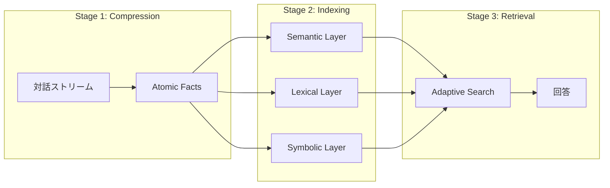

## SimpleMem とは

**SimpleMem** は、LLM エージェント向けの効率的な長期メモリシステム。2026年1月公開で GitHub スター数は約2,300。arXiv 論文あり。

https://github.com/aiming-lab/SimpleMem

コンセプトは「**Semantic Lossless Compression**」。意味を損なわずに圧縮し、最小トークンで最大の情報密度を実現する。

## ベンチマーク結果

[LOCOMO](https://arxiv.org/abs/2402.17753) ベンチマーク（GPT-4.1-mini）：

| モデル | 構築時間 | 検索時間 | 総時間 | F1スコア |
|--------|---------|---------|--------|----------|
| A-Mem | 5140.5s | 796.7s | 5937.2s | 32.58% |
| Mem0 | 1350.9s | 583.4s | 1934.3s | 34.20% |
| LightMem | 97.8s | 577.1s | 675.9s | 24.63% |
| **SimpleMem** | **92.6s** | **388.3s** | **480.9s** | **43.24%** |

**mem0 との比較：**
- F1 スコア: +26.4% 向上
- 総処理時間: 4× 高速
- トークン使用: 30× 削減（フルコンテキスト比）

## 3段階パイプライン



### Stage 1: Semantic Structured Compression

対話を「**Atomic Facts**」（自己完結した事実）に変換：

```diff
- Input:  "He'll meet Bob tomorrow at 2pm"
+ Output: "Alice will meet Bob at Starbucks on 2025-11-16T14:00:00"
```

**変換のポイント：**
- 代名詞を解決（He → Alice）
- 相対時間を絶対時間に（tomorrow → 2025-11-16）
- 曖昧さを排除

これにより、検索時の推論オーバーヘッドを**書き込み時に前払い**する。

### Stage 2: Structured Multi-View Indexing

3層でインデックス化：

| レイヤー | タイプ | 目的 | 実装 |
|---------|-------|------|------|
| **Semantic** | Dense | 概念的類似性 | ベクトル埋め込み（1024次元） |
| **Lexical** | Sparse | 完全一致 | BM25 キーワードインデックス |
| **Symbolic** | Metadata | 構造化フィルタ | タイムスタンプ、エンティティ |

### Stage 3: Complexity-Aware Adaptive Retrieval

クエリの複雑度に応じて検索深度を動的調整：

```
k_dyn = k_base × (1 + δ × C_q)
```

| クエリ複雑度 | トークン数 | 動作 |
|-------------|-----------|------|
| 低 | ~100 | 分子ヘッダーのみ取得 |
| 高 | ~1000 | 詳細な atomic コンテキストまで展開 |

シンプルな質問には少ないトークン、複雑な質問には多めのトークン。

## MCP サーバー

クラウドホスト版が利用可能：

```json
{
  "mcpServers": {
    "simplemem": {
      "url": "https://mcp.simplemem.cloud/mcp",
      "headers": {
        "Authorization": "Bearer YOUR_TOKEN"
      }
    }
  }
}
```

**対応クライアント：**
- Claude Desktop
- Cursor
- LM Studio
- Cherry Studio

## Claude Skills 対応

Claude.ai で直接使用可能。長期情報やプロジェクト履歴を会話をまたいで記憶。

## 使用例

```python
from main import SimpleMemSystem

# 初期化
system = SimpleMemSystem(clear_db=True)

# 対話を追加（Stage 1 で自動圧縮）
system.add_dialogue(
    "Alice", 
    "Bob, let's meet at Starbucks tomorrow at 2pm", 
    "2025-11-15T14:30:00"
)
system.add_dialogue(
    "Bob", 
    "Sure, I'll bring the market analysis report", 
    "2025-11-15T14:31:00"
)

# 確定
system.finalize()

# クエリ（Stage 3 で適応的検索）
answer = system.ask("When and where will Alice and Bob meet?")
print(answer)
# Output: "16 November 2025 at 2:00 PM at Starbucks"
```

### 並列処理

大規模データ向け：

```python
system = SimpleMemSystem(
    clear_db=True,
    enable_parallel_processing=True,
    max_parallel_workers=8,
    enable_parallel_retrieval=True,
    max_retrieval_workers=4
)
```

## インストール

```bash
# PyPI から
pip install simplemem

# または GitHub から
git clone https://github.com/aiming-lab/SimpleMem.git
cd SimpleMem
pip install -r requirements.txt
```

## 他ツールとの比較

| 観点 | mem0 | SimpleMem |
|------|------|-----------|
| F1 スコア | 34.20% | **43.24%** |
| 処理時間 | 1934.3s | **480.9s** |
| アプローチ | 汎用メモリレイヤー | **効率特化** |
| 圧縮 | なし | **Semantic Lossless** |
| MCP | OpenMemory（有料） | **無料クラウド** |
| Claude Skills | ❌ | ✅ |

## 注意点

### 新しいプロジェクト

2026年1月公開。実績はまだ少ない。

### OpenAI API 依存

現状は OpenAI 互換 API が必要（Qwen、Azure OpenAI も可）。

### 圧縮のオーバーヘッド

Stage 1 の圧縮処理に LLM を使用。書き込みコストと検索コストのトレードオフ。

## まとめ

SimpleMem の特徴：

- **効率重視** - 30× トークン削減、4× 高速（vs mem0）
- **高精度** - LOCOMO で 43.24% F1（SOTA級）
- **Semantic Lossless Compression** - 意味を保って圧縮
- **3層インデックス** - Semantic / Lexical / Symbolic
- **Adaptive Retrieval** - クエリ複雑度に応じた動的検索
- **MCP + Claude Skills** - すぐに使える

mem0 より新しく、ベンチマークでは上回る性能。「効率」を重視するなら検討の価値あり。

## 関連記事

- [mem0: AIエージェントのためのメモリレイヤー](/yasuhito/articles/mem0-ai-memory-layer)
- [memvid: シングルファイルで完結するAIメモリ](/yasuhito/articles/memvid-single-file-memory)
- [claude-mem: Claude Code に永続メモリを追加する](/yasuhito/articles/claude-mem-persistent-memory)
